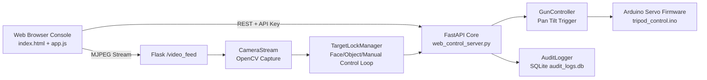

# AIR0214 Smart RWS Platform

Remote Weapon Station control stack with:
- secure dual-role API access,
- OpenCV-powered AI target lock,
- live web command console,
- persistent command audit trail,
- startup diagnostics and self-test automation.

---

## System Snapshot

| Area | What it does |
|---|---|
| Live Ops UI | Real-time camera feed, joystick aiming, keyboard control, fire/center commands |
| AI Assist | Face lock, centered object lock, and manual target locking reticle |
| API Security | RBAC, per-route enforcement, rate limiting, request hardening |
| Reliability | Idempotent fire handling, cooldown guard, response-time/request-id tracing |
| Traceability | SQLite audit logs for movement, fire, and lock-control events |

---

## Visual Architecture



---

## New AI Features Added

### 1) AI Target Lock (OpenCV)

Three tracking modes are integrated directly into the server and web UI:

- Face mode
  - Uses Haar cascade frontal-face detection.
  - Picks the strongest candidate near frame center.

- Centered object mode
  - Uses foreground segmentation (MOG2) and contour scoring.
  - Tracks the dominant moving object nearest the center.

- Manual target locking mode
  - Operator drags a reticle circle over the live camera frame.
  - The selected manual point becomes the lock reference.
  - Uses cursor-style absolute mapping from reticle position to pan/tilt angles.
  - Adds filtered manual response for smooth yet fast tracking behavior.

Servo correction behavior:

- Computes normalized frame error for target center.
- Applies configurable proportional pan/tilt correction.
- Uses deadzone and max-step limits to reduce oscillation.

Live stream overlay now shows:
- center crosshair,
- detected target bounding box,
- lock mode and confidence status text.

### 2) Web UI Integration

Added operator controls to dashboard:

- mode switch: Face / Centered object / Manual target locking,
- lock enable/disable,
- live deadzone tuning,
- pan gain tuning,
- manual response tuning,
- lock telemetry cards (mode, state, confidence),
- draggable reticle overlay visible in Manual mode.

### 4) Industry-Grade Responsiveness Plan (Executed)

The following upgrades were planned and implemented:

- Control precision path
  - Manual mode changed from visual error chasing to absolute cursor-style mapping.
  - This removes oscillation and improves point-to-point accuracy.

- Real-time smoothness
  - Added manual response filter in backend loop (configurable).
  - Added non-blocking reticle drag updates so UI does not stall on network RTT.
  - Reduced dashboard state polling interval for near real-time telemetry refresh.

- Operational hardening
  - Maintained request IDs, payload guards, scoped rate limits, and idempotent fire path.
  - Continued audit logging for manual target and lock config actions.

- Tactical UX
  - Shifted console styling to military HUD visual language.
  - Reticle and panel visuals optimized for operator clarity.

### 3) API Hardening and Request Handling Tricks

Added robust request-handling mechanisms:

- Request-ID tracing
  - Accepts or generates X-Request-ID.
  - Echoes X-Request-ID and X-Response-Time-Ms in responses.

- Payload guard
  - Enforces JSON content-type for body-carrying API calls.
  - Rejects oversized payloads with configurable max bytes.

- Scoped rate limiting
  - Keys by IP + role + method + path for fairer throttling.

- Fire endpoint safety
  - Idempotency-Key support to avoid duplicate fire on retries.
  - Cooldown protection to prevent burst trigger requests.

---

## Project Layout

```text
audit_logger.py            # Durable SQLite audit trail
cursor_controller.py       # Desktop fallback controller
gun_controller.py          # Thread-safe servo command layer
visual_stabilizer.py       # Standalone NCC stabilizer mode
web_control_server.py      # FastAPI + Flask + AI target lock integration

templates/index.html       # Main operator dashboard
static/app.js              # Frontend control + API wiring
static/styles.css          # Console styling

templates/self_test.html   # Startup diagnostics page
static/self_test.js        # Self-test logic

tripod_control/            # Arduino firmware
servo_test/                # Arduino servo test sketch
```

---

## API Surface

### Public

- GET /api/health
- GET /api/public-config

### Observer + Operator

- GET /api/state
- GET /api/target-lock/state

### Operator Only

- POST /api/aim
- POST /api/angles
- POST /api/center
- POST /api/fire
- POST /api/self-test
- POST /api/target-lock/config
- POST /api/target-lock/enable
- POST /api/target-lock/disable
- POST /api/target-lock/manual-target
- GET /api/audit

---

## Security and Environment

Set keys before launch:

```bash
export RWS_OPERATOR_KEY="replace-with-operator-key"
export RWS_OBSERVER_KEY="replace-with-observer-key"
export RWS_RATE_LIMIT_PER_MIN=120

# optional hardening controls
export RWS_MAX_API_BODY_BYTES=32768
export RWS_IDEMPOTENCY_TTL_SECONDS=30
export RWS_FIRE_COOLDOWN_SECONDS=0.45
```

If only one key is used:

```bash
export RWS_API_KEY="legacy-single-key"
```

---

## Quick Start

### 1) Install

```bash
python3 -m venv .venv
source .venv/bin/activate
pip install -r requirements.txt
```

### 2) Run Platform

```bash
python3 web_control_server.py
```

### 3) Open Console

- Main UI: http://localhost:8000/
- Diagnostics: http://localhost:8000/self-test

---

## AI Target Lock Usage

1. Open main dashboard.
2. Select lock mode (Face, Centered object, or Manual target locking).
3. Adjust deadzone and pan gain sliders.
4. If using Manual mode, drag the reticle in the camera window to your desired visual point.
5. Tune Manual response: lower for smoother movement, higher for faster movement.
6. Click Enable Lock.
7. Observe lock state and confidence; tune gain/deadzone/manual response to minimize overshoot.

Recommended tuning baseline:

- deadzone: 0.05 to 0.08
- pan gain: 1.8 to 2.8
- manual response: 0.25 to 0.55

---

## Hardware Contract

Serial frame to Arduino:

```text
PAN,TILT,TRIGGER\n
```

Servo mapping:
- Pan: pin 5
- Tilt: pin 6
- Trigger: pin 9

Ranges:
- Pan: 0..180
- Tilt: 70..110
- Trigger safe/fire: 45 / 135

---

## Validation Checklist

- Verify observer cannot call control endpoints.
- Verify operator can use all control + target lock routes.
- Verify /api/state includes target_lock block.
- Verify target_lock.manual_target_norm updates while dragging reticle in Manual mode.
- Verify target_lock.manual_target_filtered and manual_response in /api/state.
- Verify fire cooldown and idempotency behavior.
- Verify /api/audit records target lock config events.
- Verify video feed overlay shows lock status and bounding box.

---

## Safety Notice

Operate only in legal, controlled, and approved test environments.
Always validate software behavior in preview mode before enabling physical actuation.